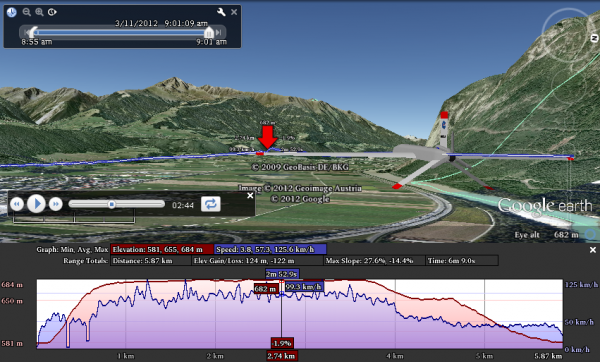

>Software downloads and install instructions can be [found here](install.md).

## HTTP Server

The GCS app has built-in HTTP server (listening on port **9080**).

Server capabilities include:

* Provide datalink stream to other GCS components
* Control any particular Mandala variable
* Execute JavaScript commands
* Return any or all Mandala variable values
* [Google Earth](http://earth.google.com) real-time flight visualization and analyzis of telemetry data.

To see the server welcome message - start the GCS and open this link in browser:

[http://127.0.0.1:9080](http://127.0.0.1:9080)

## Multiple GCS operation

The GCS software upon startup will look for available servers and try to connect with the following order:

* Localhost server
* Last successfully connected server
* Next available server

Although, the GCS will try to bind its own default server on local machine.

When GCS finds another server in local network, it appears under menu `Preferences/Datalink/Remote servers` and can be used for datalink connection.

## VPN Support

Datalink server (part of GCS Software) has the capability to establish connection through internet with another GCS.

Two or more GCS interfaces could be connected to one or more datalink modems. the connection requires **static ip**, thus VPN connection is recommended.

To request for online support for tuning or troubleshooting, [contact us](../contacts.md) to receive credentials to access our network.

The connection through our network can be established via menu `Help/VPN Support`.

## Mandala control

The server will accept any request beginning with `/mandala`. The request parameters are following `?` char, and are optional. Several request parameters can be combined in one request and separated by the `&` sign.

The following parameters are accepted:

* `<variable name>` - will return it's value, f.ex. '?ctr_brake'
* `<variable name>=<value>` - will set the new value and send it to UAV
* `descr` - variables will be returned with their descriptions
* `scr=<QtScript text>` - will execute a QtScript

For example, assuming you run GCS on the local machine, the following requests are valid:

* [http://127.0.0.1:9080/mandala](http://127.0.0.1:9080/mandala) - will return xml list of all variables and their current values.
* [http://127.0.0.1:9080/mandala?descr](http://127.0.0.1:9080/mandala?descr) - same as above, but will include descriptions
* [http://127.0.0.1:9080/mandala?descr&cmd_altitude&roll](http://127.0.0.1:9080/mandala?descr&cmd_altitude&roll) - will return only two values specified, with descriptions
* [http://127.0.0.1:9080/mandala?cmd_altitude=1000&roll](http://127.0.0.1:9080/mandala?cmd_altitude=1000&roll) - will set commanded altitude to 1km and return current values
* [http://127.0.0.1:9080/mandala?mode=mode_TAKEOFF](http://127.0.0.1:9080/mandala?mode=mode_TAKEOFF) - this will change current mode to TAKEOFF procedure
* [http://127.0.0.1:9080/mandala?scr=mode=mode_EMG](http://127.0.0.1:9080/mandala?scr=mode=mode_EMG) - will execute a QtScript to change current mode to manual control
* [http://127.0.0.1:9080/mandala?scr=ctr_brake=trigger(ctr_brake,0,1)](http://127.0.0.1:9080/mandala?scr=ctr_brake=trigger(ctr_brake,0,1)) - toggle parking brakes
* any other requests, based on the principles, described above.

## Google Earth Visualization

Add the following link to Google Earth:

`http://<IP address of GCS machine>:9080/kml`

.. i.e. if you run both the GCS and GoogleEarth on the same machine, use:

`http://127.0.0.1:9080/kml`

## Customization & Plugins

The Software Development Kit (SDK) is provided with GCS application package.

The SDK files are located here: `/usr/share/uavos/GCS/sdk/`

All user plugins should be installed in `~/.GCS/plugins` folder.

### Supported plugins

* C++ plugins, compiled with provided SDK (plugin_interface.h)
* QML files

User plugins are loaded from `Documents/UAVOS/Plugins` folder. For examples of QML plugins, see our [github repositories](http://github.com/uavos).
