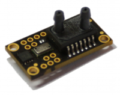

Airspeed Sensor - temperature compensated, high-accuracy sensor, connects to the pitot tube of the aircraft. This sensor is required for auto-landing and flights without GPS.

Altitude sensor is integrated with accelerometers and complexed by MEKF to achieve 1cm resolution and fast response for variometer.

Pitot Tube's heater control is equipped with ADC and power switch to stabilize the temperature.

## Node Features

- Pitot tube heater control circuit
- RS485 interface (NMEA, raw data)
- Temperature compensation (AT/RT)

#### System features

- Industrial [CAN](https://en.wikipedia.org/wiki/CAN_bus) interface
- Extended temperature range -40..+80°C
- 4.5V...30V input power supply
- Power supply reverse-polarity protection (self-recoverable)

## Capabilities

- [Airspeed sensor](../../fw/conf/airspeed.md)
- [Altimeter](../../fw/conf/altimeter.md)
- [Analog inputs](../../fw/conf/ain.md)
- [CANaerospace](../../fw/conf/canas.md)
- [Pitot heater](../../fw/conf/heater.md)

## PCB Pinouts

- [cas-AP10](pinouts/cas-AP10.pdf)
- [cas-AP9](pinouts/cas-AP9.pdf)
