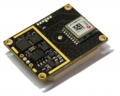

The board uses the latest concurrent reception of GPS/QZSS, GLONASS, BeiDou MAX-M8 module and a passive built-in antenna.

There is no need for HF cables to the antenna and receiver.

There could be several GPS devices connected to the same system, located on different sides of the UAV for reliability of navigation (f.ex. some VTOLs).

In addition, GPS module have redundant Compass Module (3-axis magnetic field sensor) which can be used as a source for the AHRS (integrated to NAV node). This allows to avoid strong magnetic disturbances in sensitive applications (f.ex. Helicopters).

Includes additional Nine-Axis (Gyro + Accelerometer + Compass) inertial sensors.

#### System features

- Industrial [CAN](https://en.wikipedia.org/wiki/CAN_bus) interface
- Extended temperature range -40..+80°C
- 4.5V...30V input power supply
- Power supply reverse-polarity protection (self-recoverable)

## Capabilities

- [GPS Receiver](../../fw/conf/gps.md)
- [Inertial Measurement Unit](../../fw/conf/imu.md)

## PCB Pinouts

- [gps-AP10](pinouts/gps-AP10.pdf)
- [gps-AP9](pinouts/gps-AP9.pdf)
- [gps-AP9R1](pinouts/gps-AP9R1.pdf)
