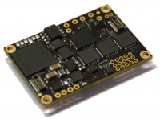

This is optional component and it can be used to extend AP system with additional interfaces.

Interface Controller Board contains a number of various interfaces and is used to interface AP system to servos, measure voltages, power control,
input and output of different digital and analog signals. This board also contains a number of standard ports: 3V UART, RS485, RS232, CAN, 1-wire, i2c and others, which could be used to communicate with payload devices and to integrate standard avionics. The on-board software allows to extend autopilot system with any number of IFC boards connected to the same CAN network.

The built-in analog multiplexer is used to map logical signal to any of twelve physical ports of the board.

Some modifications of this node have power switches to control power lines, and also may include isolated RS232-485-422 and CAN interfaces.

## Node Features

- 12x general purpose input/output ports connected to the multiplexer
    - 8 analog inputs (4x high voltage)
    - 2x CAN interfaces
    - 2x UART TTL / RS-232 / RS-485 serial ports with controlled termination
    - 1-wire interface
    - 12x 5V drivers (GPO/PWM outputs)
- Power distribution switch 2 in 3 out
- Independent switched power output with integrated Step-Down converter (0.5A, +5V).
- Independent switched power output with integrated Step-Down converter (0.5A, +3.3V).

#### System features

- Industrial [CAN](https://en.wikipedia.org/wiki/CAN_bus) interface
- Extended temperature range -40..+80°C
- 4.5V...30V input power supply
- Power supply reverse-polarity protection (self-recoverable)

## Capabilities

- [Analog inputs](../../fw/conf/ain.md)
- [Autopilot controls](../../fw/conf/shiva.md)
- [Auxilary CAN](../../fw/conf/can2.md)
- [CANopen](../../fw/conf/canopen.md)
- [Inertial Measurement Unit](../../fw/conf/imu.md)
- [Inertial Navigation](../../fw/conf/ahrs.md)
- [OneWire interface](../../fw/conf/onewire.md)
- [Ports Multiplexer](../../fw/conf/mux.md)
- [Ports and controls](../../fw/conf/ports.md)
- [Power monitor](../../fw/conf/imon.md)
- [Serial Ports](../../fw/conf/serial.md)
- [Serial Protocols](../../fw/conf/protocols.md)
- [USB Interface](../../fw/conf/usb.md)
- [Virtual Machine](../../fw/conf/vm.md)

## PCB Pinouts

- [ifc-AP10](pinouts/ifc-AP10.pdf)
- [ifc-AP9](pinouts/ifc-AP9.pdf)
- [ifc-AP9R1](pinouts/ifc-AP9R1.pdf)
