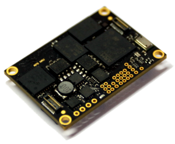

The main board is the heart of the system. It integrates an Inertial Measurement Unit (IMU) and navigation processor.

## Node Features

- Backup battery, RTC for 2 weeks
- FRAM non-volatile high-speed memory
- 12x GPIO ports (3V)
- RS232, RS485, 2xCAN interfaces
- Redundant IMU (Gyro + Accelerometer + Compass + Pressure) MEMS MotionTracking Devices:
    * [MPU-6000](https://www.invensense.com/products/motion-tracking/6-axis/mpu-6050/) Gyroscopes and Accelerometers
    * [HMC5983](http://www51.honeywell.com/aero/common/documents/myaerospacecatalog-documents/Defense_Brochures-documents/HMC5983_3_Axis_Compass_IC.pdf) Magnetic Compass
    * [BMG160](http://www.bosch-sensortec.com/bst/products/all_products/bmg160) Gyroscopes
    * [LSM303D](http://www.st.com/en/mems-and-sensors/lsm303d.html) Accelerometers and Magnetic Compass
    * [MS5611](http://www.amsys.info/products/ms5611.htm) Precision Micro Barometer Module
- Digital Microphone for ambient noise analysis

#### System features

- Industrial [CAN](https://en.wikipedia.org/wiki/CAN_bus) interface
- Extended temperature range -40..+80°C
- 4.5V...30V input power supply
- Power supply reverse-polarity protection (self-recoverable)

## Capabilities

- [Altimeter](../../fw/conf/altimeter.md)
- [Analog inputs](../../fw/conf/ain.md)
- [Autopilot controls](../../fw/conf/shiva.md)
- [Auxilary CAN](../../fw/conf/can2.md)
- [CANopen](../../fw/conf/canopen.md)
- [Gimbal](../../fw/conf/gimbal.md)
- [Inertial Measurement Unit](../../fw/conf/imu.md)
- [Inertial Navigation](../../fw/conf/ahrs.md)
- [Onboard data recorder](../../fw/conf/blackbox.md)
- [Ports and controls](../../fw/conf/ports.md)
- [Power monitor](../../fw/conf/imon.md)
- [Real Time Clock](../../fw/conf/rtc.md)
- [Sensors redundancy](../../fw/conf/imu-redundancy.md)
- [Serial Ports](../../fw/conf/serial.md)
- [Serial Protocols](../../fw/conf/protocols.md)
- [Virtual Machine](../../fw/conf/vm.md)

## PCB Pinouts

- [nav-AP10](pinouts/nav-AP10.pdf)
- [nav-AP9](pinouts/nav-AP9.pdf)
- [nav-AP9R1](pinouts/nav-AP9R1.pdf)
