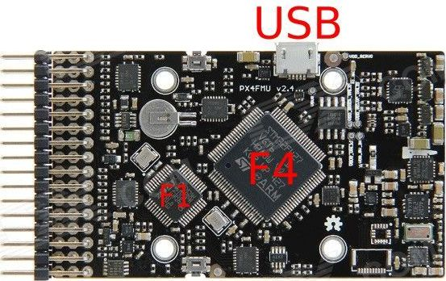
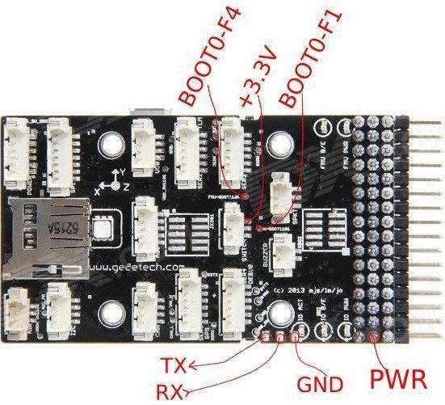
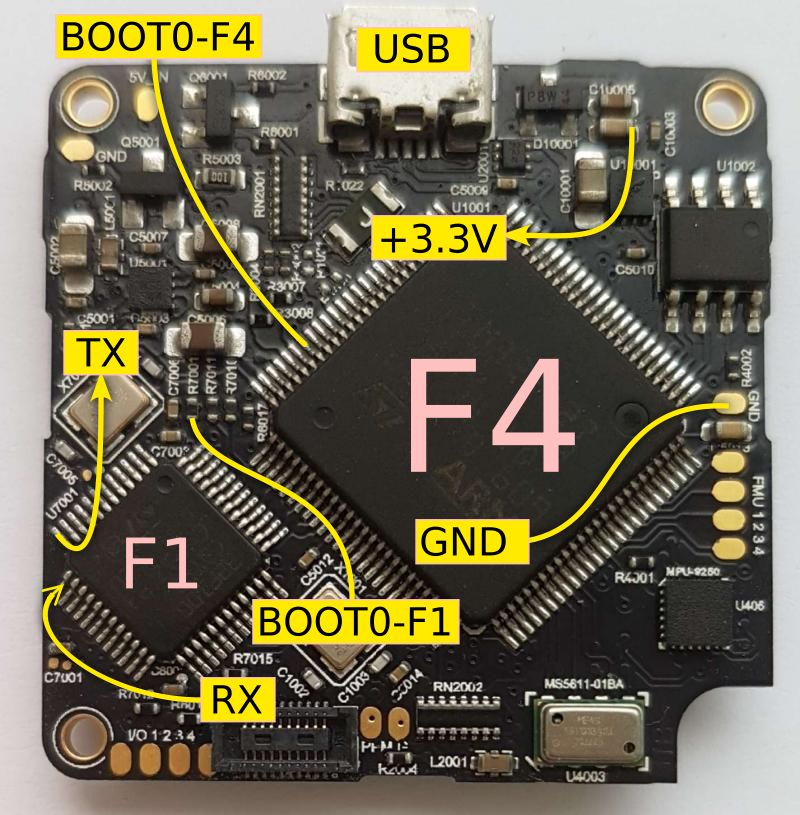

The AP system firmware could be used to evaluate it on the Open Hardware
platforms:

- [Pixhawk PX4 (FMUv2)](https://pixhawk.org/modules/pixhawk)
- [Pixhawk CUBE (FMUv3)](https://pixhawk.org/modules/pixhawk2)

The firmware functionality allows to run AP system on FMUv2/FMUv3 board and use of
standard external peripherals from Ardupilot market. Firmware is fully
compatible with all APx nodes.

The firmware files are part of the gcu software package and are located here:
/usr/share/uavos/firmware/armv7-m/FMU2/

After you finish the procedure, the new nodes behavior will be the same as
standard APx nodes, i.e. you could do further firmware updates, etc. Note, that
x4io node is connected internally **through** the xhawk node.

Some additional information, could be found
[here](https://pixhawk.org/dev/bootloader_update).

## Hardware requirements

There are two stm32 chips on the board:

- **xhawk** (stm32f4), used as primary flight controller and IMU.
- **x4io** (stm32f1), used as port extender and PWM servo signals generator.

### FMUv2 board





### FMUv3 board



### Connections

The key **stm32f4** pin numbers:

- **94** `BOOT0-F4`

The key **stm32f1** pin numbers:

- **44** - `BOOT0-F1`
- **12** - `Serial TX data output`
- **13** - `Serial RX data input`


The stm32f4 could be flashed through USB connector. To flash stm32f1 you will
need to solder PC-USB-UART wires to the board and connect BOOT0 pads of both
stm32 chips to +3.3v.

The +3.3V wire on the board is output, i.e. it provides the voltage from the
internal regulator, thus **there is no need for external power supply during the
procedure**.

The PC-USB-UART stick should provide TTL level UART signals RX (input), TX
(output). The levels could be either 3.3V or 5V. The stm32f1 chip signals are
5V tolerant.

The board could be powered either from USB connector (the default for flashing
F4), or through `PWR` wire +5V (for F1 flashing). Although, it is still ok to power
board through USB connector for F1 procedure.

The *IMU* and *Main Connectors* board of FMUv3 could be disconnected during
flash procedure, i.e. only the board shown on the picture is required, with the
connection to the USB port of a PC (for power and F4 dfu flash).

## Flashing F4
Connect shortcut `BOOT0-F4` to `+3.3V` and connect USB cable from PC to the
board.

Type in linux console:

```bash
dmesg|tail
```
the output should look like this:

```bash
[43896.790821] usb 1-5: new full-speed USB device number 9 using xhci_hcd
[43896.919746] usb 1-5: New USB device found, idVendor=0483, idProduct=df11
[43896.919749] usb 1-5: New USB device strings: Mfr=1, Product=2, SerialNumber=3
[43896.919750] usb 1-5: Product: STM32  BOOTLOADER
[43896.919751] usb 1-5: Manufacturer: STMicroelectronics
[43896.919752] usb 1-5: SerialNumber: 336136783134
```

Now, use your favorite DFU utility to flash the file
`/usr/share/uavos/firmware/armv7-m/FMU2/loader-xhawk.hex` to the chip.

Note, the firmware is compatible with both 'FMUv2' and 'FMUv3 (CUBE)' boards.

You may need to install **dfu-util** package and **binutils-arm-none-eabi**
package for arm-none-eabi-objcopy (to convert hex file to bin).

```bash
sudo apt-get install dfu-util binutils-arm-none-eabi
```

Now prepare the file for dfu-util tool (convert hex to bin):

```bash
arm-none-eabi-objcopy -I ihex /usr/share/uavos/firmware/armv7-m/FMU2/loader-xhawk.hex -O binary /tmp/loader-xhawk.bin
```

Now flash the loader to the stm32f4 chip:

```bash
sudo dfu-util -d 0483:df11 -a 0 -s 0x08000000 -D /tmp/loader-xhawk.bin
```

The output:

```bash
dfu-util 0.8

Copyright 2005-2009 Weston Schmidt, Harald Welte and OpenMoko Inc.
Copyright 2010-2014 Tormod Volden and Stefan Schmidt
This program is Free Software and has ABSOLUTELY NO WARRANTY
Please report bugs to dfu-util@lists.gnumonks.org

dfu-util: Invalid DFU suffix signature
dfu-util: A valid DFU suffix will be required in a future dfu-util release!!!
Deducing device DFU version from functional descriptor length
Opening DFU capable USB device...
ID 0483:df11
Run-time device DFU version 011a
Claiming USB DFU Interface...
Setting Alternate Setting #0 ...
Determining device status: state dfuERROR, status 10
dfuERROR, clearing status
Determining device status: state dfuIDLE, status 0
dfuIDLE, continuing
DFU mode device DFU version 011a
Device returned transfer size 2048
DfuSe interface name: "Internal Flash  "
Downloading to address 0x08000000, size 20716
Download        [=========================] 100%        20716 bytes
Download done.
File downloaded successfully
```

Now remove the shortcut between `BOOT0-F4` and `+3.3V`, and disconnect the USB
cable. Start the **gcu**, connect the USB cable. The GCU should find the node
**xhawk** and the heartbeat LED on the board should flash repeatedly (10Hz).

## Flashing F1

  - Connect shortcut `BOOT0-F1` to `+3.3V`
  - Connect shortcut `BOOT0-F4` to `+3.3V` to disable the F4 chip temporally.
  - Connect PC-USB-UART `GND`, `RX (in)`, `TX (out)` to corresponding `GND`, `TX
(out)`, `RX (in)` wires. Input to output and vice-versa.
  - Make sure the GCU software is closed and **not running**.

Now, connect PC-USB-UART stick to the PC, make sure you know the assigned
/dev/ttyUSB port name. The dmesg|tail output should contain:

```bash
[46245.137723] usb 1-5: cp210x converter now attached to ttyUSB0
```

Provide power to the board either through the USB connector or `PWR` wire (f.ex.
from USB-UART stick), and flash the loader:

```bash
spark -s -d /dev/ttyUSB0 /usr/share/uavos/firmware/armv7-m/FMU2/loader-x4io.hex
```

The output should look like this:

```bash
UAVOS Autopilot firmware loader v9.8-79-g2556d8c
Copyright (c) 2011 Aliaksei Stratsilatau <sa@uavos.com>
Visit http://wiki.uavos.com/ for more info.
Using serial port: /dev/ttyUSB0 (460800 baud)...
Loading file...9.7 Kb.
System loader init..OK
STM Loader Version: 2.2
MCU: STM32F10x Medium-density value line (0x0420), 128kB flash.
Erase..OK
Write...
9.7kB written (100%)...
Starting (0x08000000)..OK
Success.
```

Alternatively, use your favorite stm32 flash utility to flash the file
`/usr/share/uavos/firmware/armv7-m/FMU2/loader-x4io.hex` to the chip.

After flashing is done, remove the shortcut between `BOOT0-F1` and `+3.3V` and
reset power. The heartbeat LED should blink 10Hz.

Remove all wires and shortcuts, disconnect the USB-UART stick, and connect the
board to the PC with the `USB` connector.

Start the GCU software, it should find at least the node **xhawk**. Update
firmware through the menu. The node **x4io** should appear in GCU. Update the
firmware through GCU menu for **x4io** node also.
